# 基于 Unet 的左心室分割模型

## 1. 项目简介

本项目基于残差U-net 网络结构，使用了 Pytorch 框架，实现了对左心室的语义分割，本项目的数据集来自于Sunnybrook Cardiac Data和四川大学华西第二医院放射科。

## 2. 项目背景

### Unet

U-Net 是一种用于图像分割的深度学习架构，最初是为了解决医学图像分割问题而设计的。这种网络结构自 2015 年提出以来，已广泛应用于各种图像分割任务。这种网络结构自 2015 年提出以来，已广泛应用于各种图像分割任务。下面是 U-Net 的几个关键特征：

1. **对称的 U 形结构** ：U-Net 的名字来源于其独特的 U 形结构。这个结构包含一个收缩（下采样）路径和一个扩张（上采样）路径，这两个路径形成一个 U 型。
2. **下采样和上采样路径** ：在下采样路径中，网络通过卷积层和池化层逐步捕捉图像的上下文信息，并减少数据的空间维度。在上采样路径中，网络通过上采样和卷积操作逐步重建图像的细节和空间维度。
3. **跳跃连接** ：U-Net 的一个关键特点是它在下采样和上采样路径之间使用跳跃连接。这些连接将下采样路径中的特征图直接与上采样路径的相应层相连，帮助网络在重建图像时保留边缘和细节信息。
4. **用于精确定位的特征组合** ：跳跃连接结合了上下文信息和局部信息，使网络能够更好地执行精确的定位。

### 左心室分割

左心室分割问题是医学图像处理中的一个关键任务，主要涉及从心脏影像中准确识别并分割出左心室的区域。这一任务在心脏病的诊断和治疗评估中扮演着重要角色。

1. **重要性** ：左心室是心脏的主要泵血室，负责将氧合血泵送到全身。准确评估左心室的大小、形状和功能对于诊断多种心脏疾病（如心肌梗死、心肌病）至关重要。
2. **挑战** ：左心室分割的主要挑战包括图像质量的变异性、左心室形状和大小的个体差异、以及心脏周期中左心室形态的变化。此外，医学图像中的噪声和伪影也增加了分割的难度。
3. **自动化分割技术** ：为提高分割的准确性和效率，开发了多种自动化或半自动化的分割技术。这些技术包括基于阈值的方法、区域生长算法、形态学技术，以及最近的深度学习方法，如卷积神经网络（CNN）。
4. **临床应用** ：准确的左心室分割对于评估心脏功能（如射血分数、心室容积）至关重要。这些评估对于诊断心脏病、制定治疗计划以及监测治疗效果非常有用。
6. **深度学习的应用** ：近年来，深度学习技术，特别是卷积神经网络和 U-Net 架构，在左心室分割方面展现了优异的性能。这些方法能够从复杂的图像数据中学习特征，实现高精度的自动分割。

## 3. 安装指南

安装需求环境：

`conda create -n ResUnet python=3.8 -y`

`pip install -r requirements.txt`

部署项目到 7777 端口：

`make dev`

测试预测方法：

`make test_predict`

## 4. 使用指南

操作系统：Ubuntu 22.04

语言环境：python3.8+pytorch2.0.0+cuda11.7

数据要求：zip，包含一个含有多个断层采样文件夹的大文件夹

操作顺序：

1. 访问本地部署端口
2. 上传压缩包至服务器，点击提交
3. 跳转到结果页面，获得结果，结果显示了所有断层的左心室位置，计算了左心室在所有时刻的容量变化，并获取了患者的个人信息。

## 5. 模型架构

### 5.1 图像预处理

在原本的数据集中，由于采样的误差，导致许多数据出现亮度过低，无法正常分辨的情况，此处，引入变换块，对数据集进行伽马变换、仿射变换等灰度分布修正，使肉眼无法分辨的数据在处理后依然能够得到左心室的位置。

### 5.2 下采样块内引入ResBasic块

改变原本块内结构，引入残差操作，进一步加强模型拟合效果，降低过拟合，减小梯度消失的几率。

## 6. 测试结果和性能评估

利用MPA、mIOU、 F1-score 三项指标评估系统的分割性能。                  

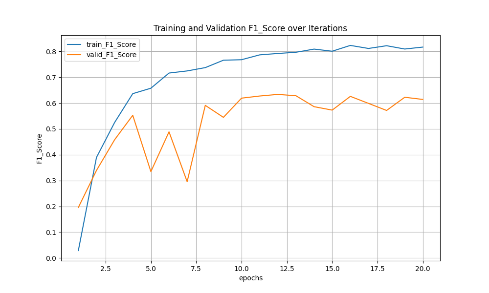

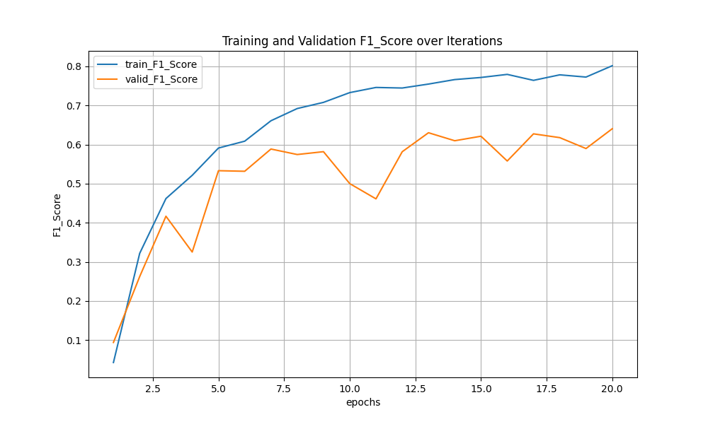

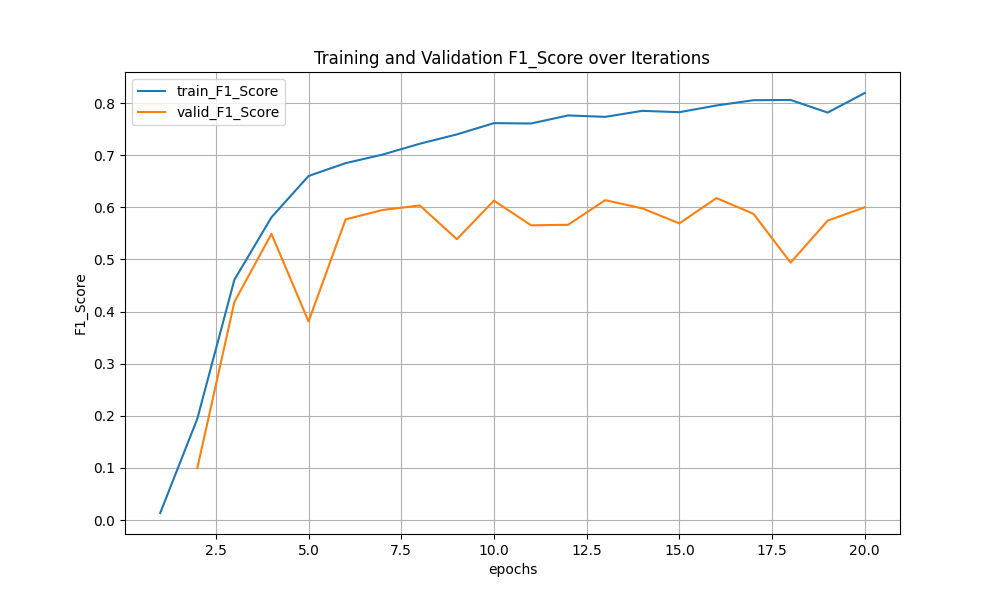

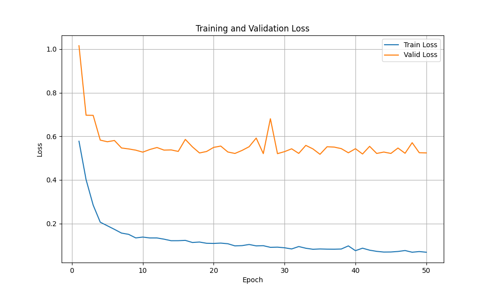

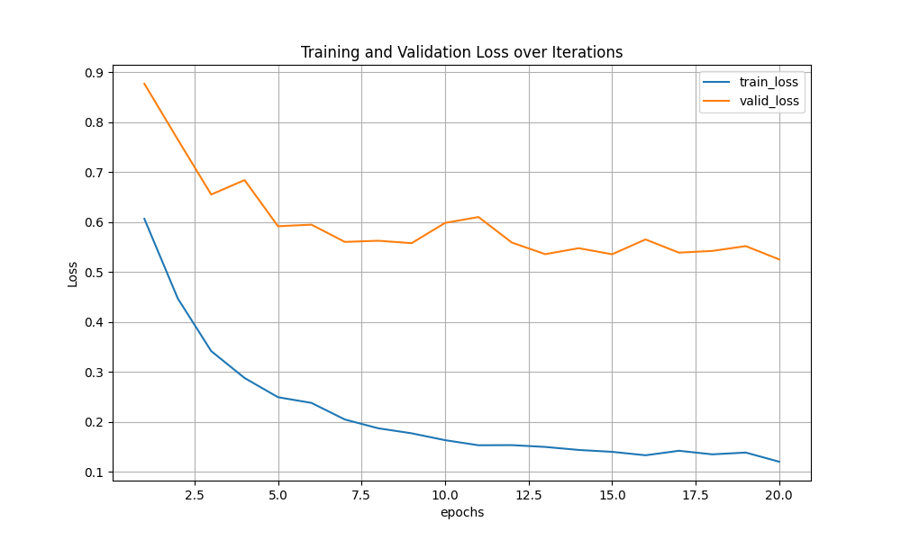

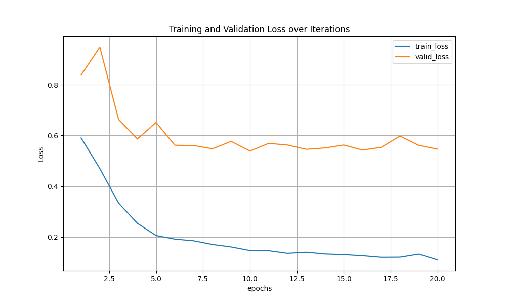

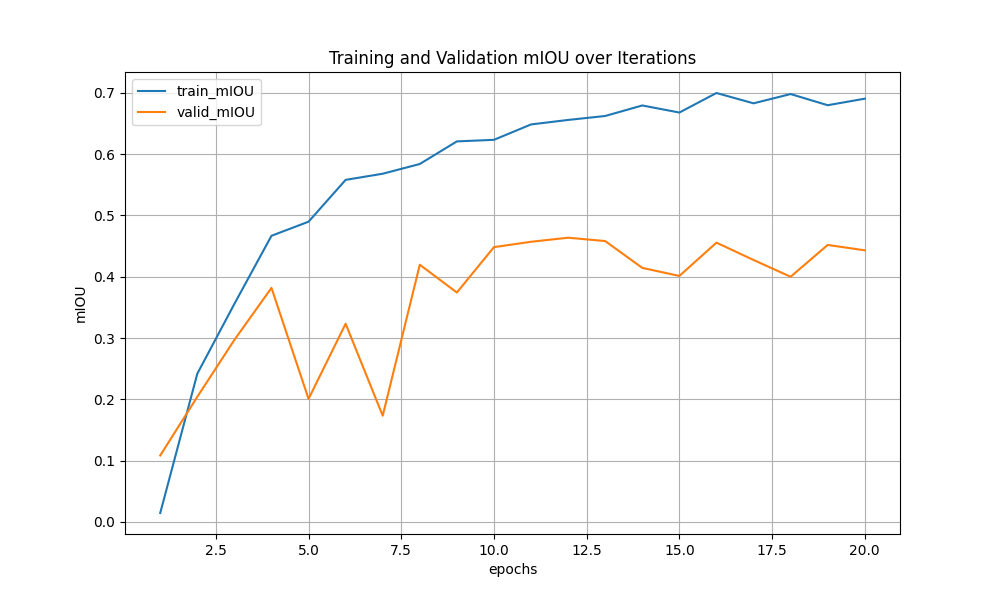

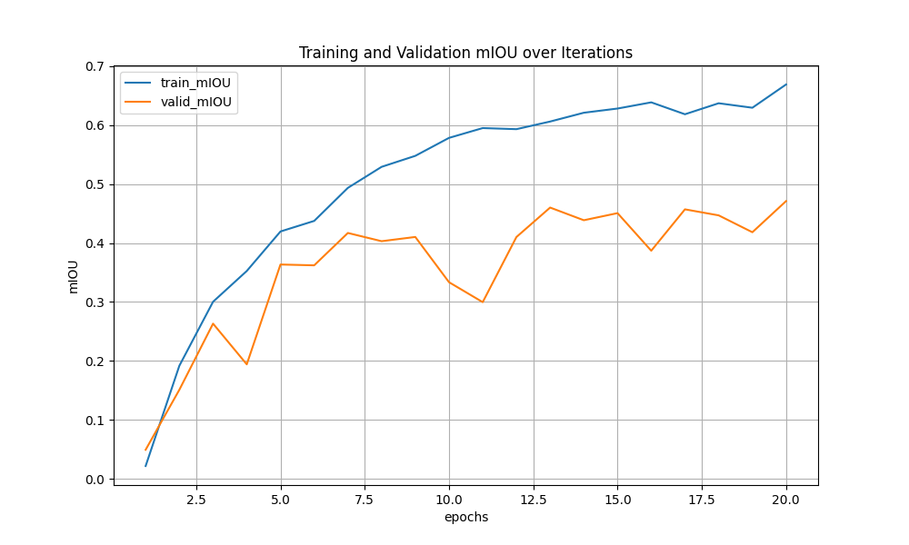

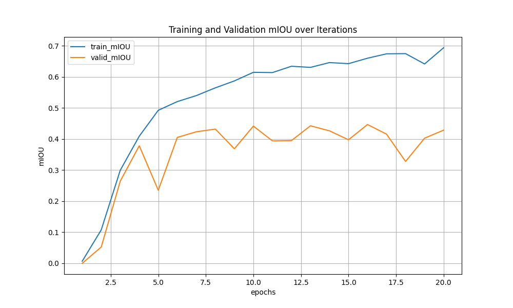

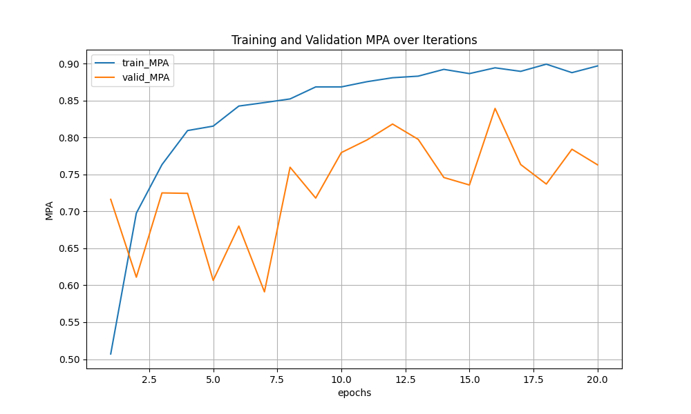

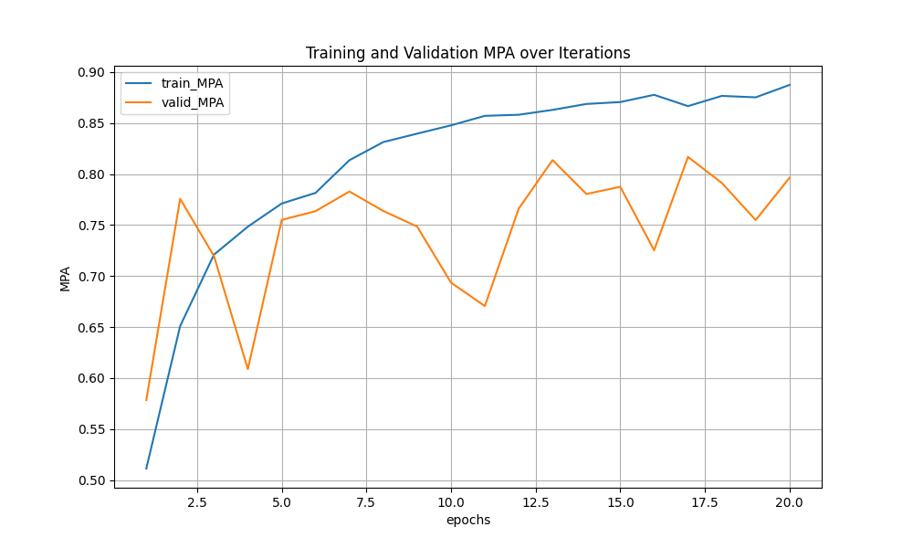

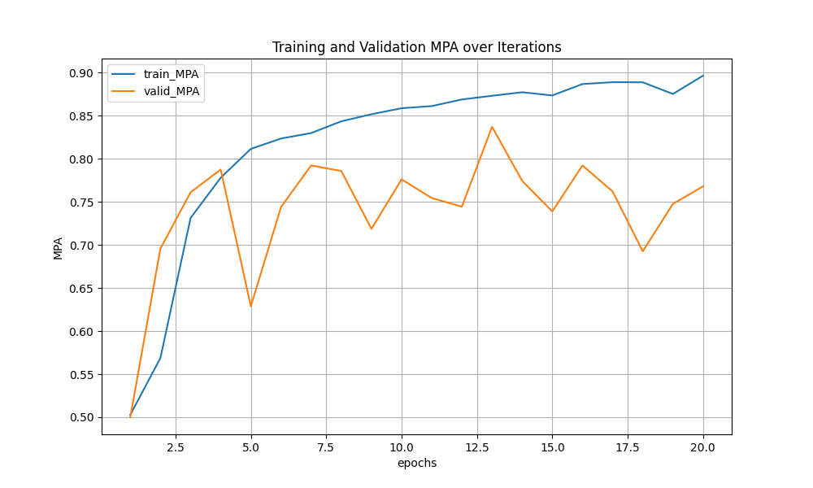

## 7.语义分割效果

预测结果：

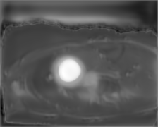

设置阈值二值化：

